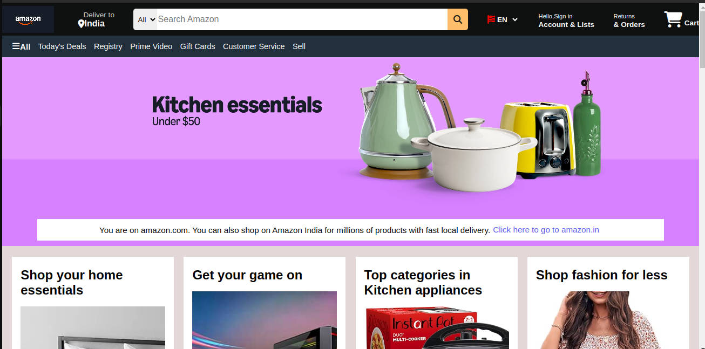

## Amazon Clone (HTML + CSS)

This is a front-end clone of the Amazon homepage, built using basic HTML and CSS.  
It replicates the structure and style of the original Amazon homepage (header, navbar, banner, product grid, and footer).

##  Screenshot

##  Folder Structure
    amazon-clone/
    │
    ├── index.html
    ├── style.css
    ├── assets/
    │   └── images/
    │       └── [multiple image files]
    ├── screenshots/
    │   └── homepage.png
    └── README.md

##  Features
- Simple navigation bar
- Hero section with background image
- Product cards with grid layout
- Footer that includes various anchor tags

##  Tools Used
- HTML
- CSS

##  What I Learned
- Structuring a webpage using semantic HTML
- Styling with CSS: flexbox, layout, colors, fonts, Animation effects
- How to organize and upload a project using Git & GitHub

##  Project Link
[GitHub Repository](https://github.com/Pratikshya-Barik/amazon-clone-html-css)

